# exploratory-web-science
Exploring the world wide web using python

Note: Each section corresponds to a subfolder. Some data visualizations were created using R. Content derived from coursework completed during grad school. Some content may be intentionally excluded as to not provide the answer to the public.


## Web Crawl
Web crawls through the internet to find links to PDFs.

```
python3 findPDFs.py https://en.wikipedia.org/wiki/List_of_apple_cultivars
```

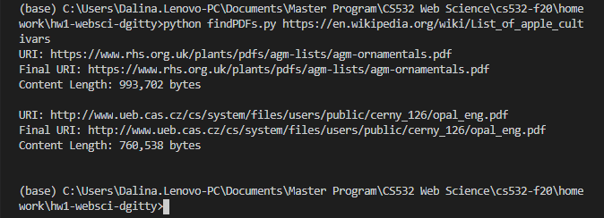


## Archiving
Web archiving.

Extracts 1000 unique links from tweets in Twitter. Records the number of redirect links, shortened links, and unique URIs.

```
python3 extractLinks.py
```

Downloading time maps. Reads from a list of unique links in the unique_links file and downloaded the timemap for each link.

```
python3 download_timemap.py
```

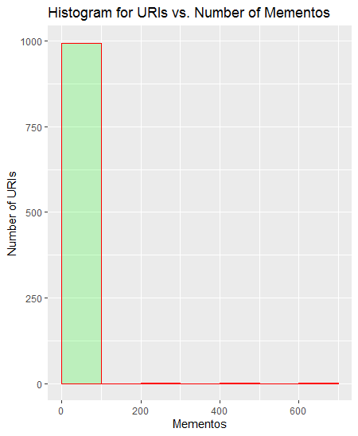


Detect early memento reads timemap_#.json file in timemap directory.

```
python3 detect_early_memento.py
```
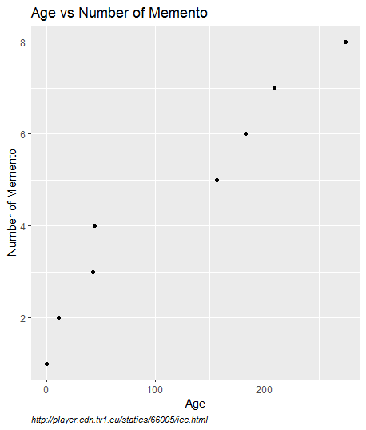


## Ranking
Ranks webpages based on query.

Downloads contents of each URI.

```
python3 download_content.py
```

Processes html file and uses boilerpy3 to extract text from html file.

```
python3 process_html.py
```

Acquire map listed between uri and hash to then provide ranked URIs by TF-IDF

```
python3 query_file.py
```

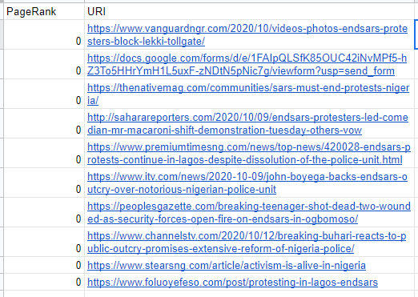

## Social Netowrks
Exploring social networks.

Acquires number of followers from each user's follower by utilizing the user's metadata.

```
python3 get_followers.py
```

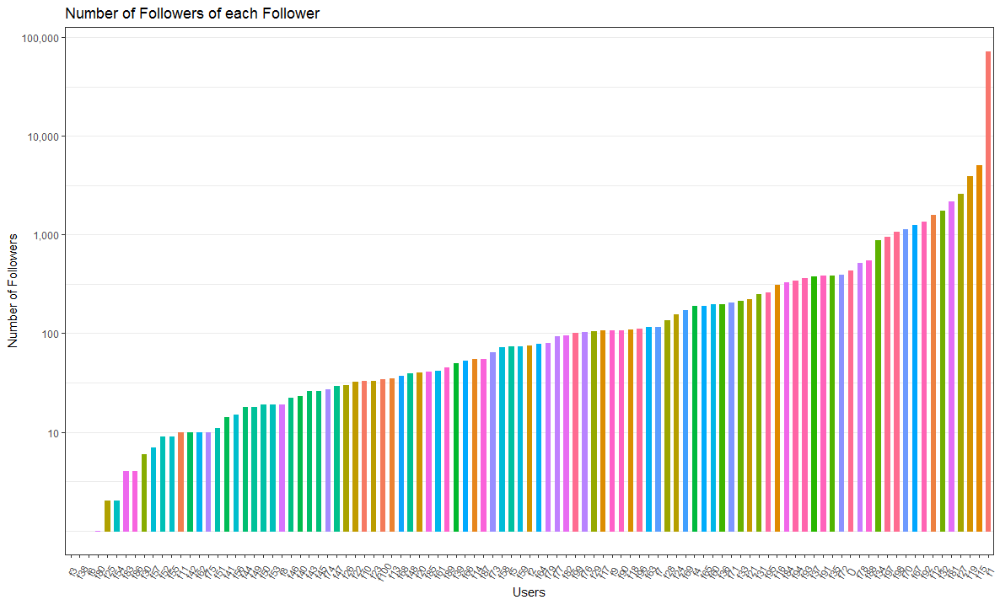

Acquires number of followed users from each user being followed by utilizing the user's metadata.

```
python3 get_followings.py
```

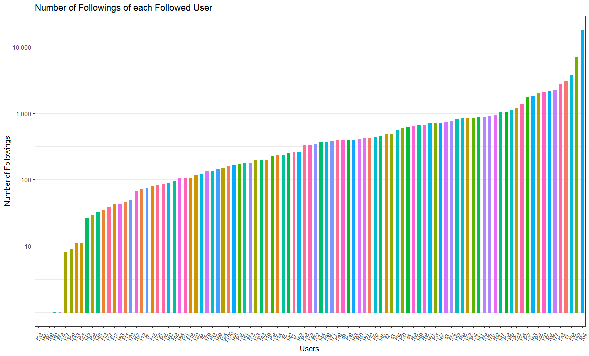


## Graph Partitioning
Generate the Karate club graph.

```
python3 plot_karate_club.py
```

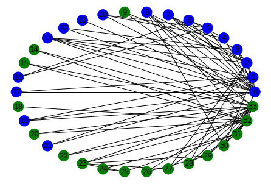


## Disinformation
Analyzing disinformation domains


Uses request library to gather links that redirect.

```
python3 q1_redirect.py
```

Acquire number of tweets per domain as well as domain information.

```
python3 q1_domain.py
```

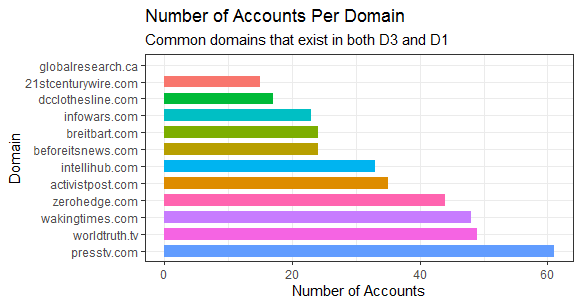

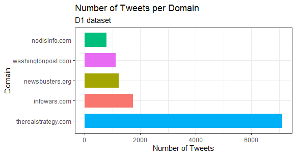


Comparing tweets per domain.

```
python3 q2_compare.py
```

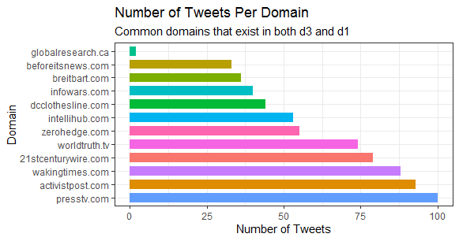

## Recommendation System

Recommending movies

```
python3 q6_loadmovie.py
```

## Clustering
Clustering items based on characteristics

Download tweets from 100 popular twitter accounts.

```
python3 q1_gettweet.py
```

Create account term matrix

```
python3 q2_creatematrix.py
```

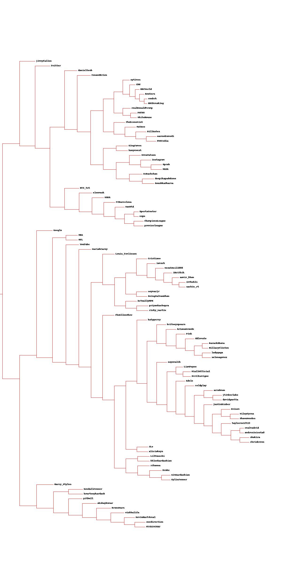


Create ASCII dendrogram

```
python3 q345_twitterdata.py
```

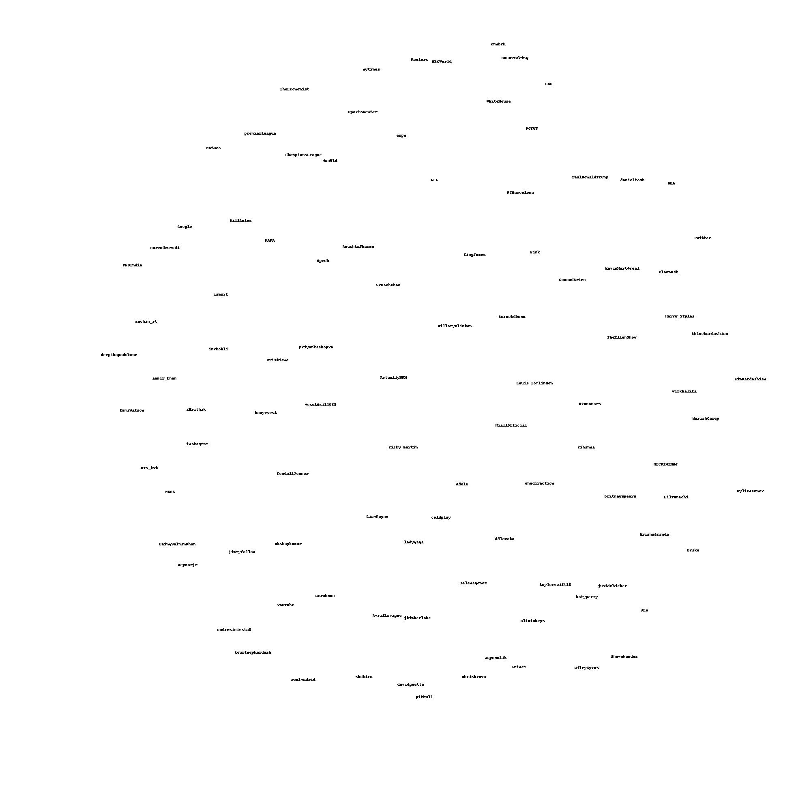

