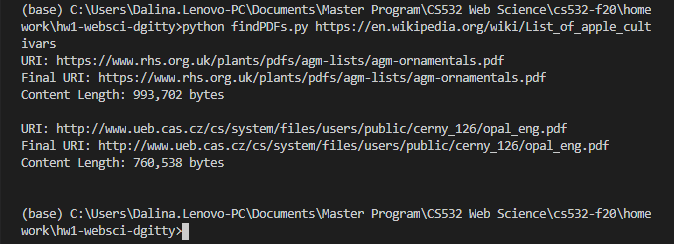

# exploratory-web-science
Exploring the world wide web using python


## Find links to PDFs
Web crawls through the internet to find links to PDFs.

```
python3 findPDFs.py https://en.wikipedia.org/wiki/List_of_apple_cultivars
```



